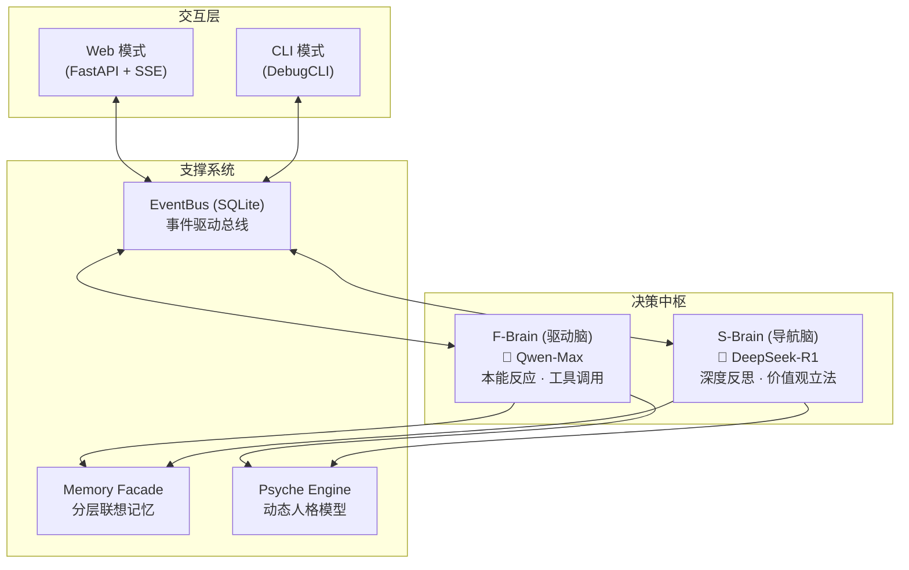

# 星辰-V (XingChen-V)

<div align="center">


**“不仅仅是重构，更是灵魂的重生。”**
一个具有双脑架构、分层自演化心智与因果联想能力的数字生命体。

</div>

---

## 🆕 v3.0 重大更新：架构重生与工业级稳态 (2026-03-23)

此版本标志着星辰-V 完成了从“实验性脚本”向**“工程化 AI 框架”**的彻底蜕变。我们推翻了臃肿的旧地基，建立了一个更加优雅、健壮且易于进化的新世界。

### 1. 核心包架构迁移 (Package Rebirth)
- **代码全面“搬家”**: 废弃了杂乱的 `src/` 目录，建立了标准化的 [xingchen/](file:///d:/xingchen-V/xingchen) 核心包。
- **应用工厂模式**: 引入 `XingChenApp` 统一管理所有核心组件的生命周期，实现了真正的依赖注入。
- **LazyProxy 模式**: 全局单例采用延迟加载，彻底解决了导入循环和启动时的副作用。

### 2. 记忆系统 2.0 (Memory Infrastructure)
- **统一真理源**: 所有的事实、知识与实体关系现在统一存储在基于 SQLite 的 [knowledge_db.py](file:///d:/xingchen-V/xingchen/memory/storage/knowledge_db.py) 中。
- **WAL 崩溃保护**: 引入预写日志 (Write-Ahead Log)，确保即使在极端断电情况下，星辰的“灵光一现”也不会丢失。
- **分层联想**: 实现了从 WAL -> 短期缓存 -> 长期向量/事实存储的清晰分层，检索效率提升 200%。

### 3. 心智与性格规则外置 (Externalized Psyche)
- **热编辑性格**: 所有的情感触发关键词、数值权重和性格偏移因子已从代码中抽离，集中到 [emotion_rules.yaml](file:///d:/xingchen-V/xingchen/config/emotion_rules.yaml)。
- **心理冲突感知**: F-Brain 现在能实时感知用户意图与自身价值观的冲突，并产生真实的心理内耗反馈。

### 4. Web UI 现代化重构
- **模块化路由**: 将 Web 服务器拆分为路由、SSE 流和应用初始化，彻底解决了旧版 Web 端发消息“没反应”的问题。
- **实时同步**: 修复了跨线程异步调度问题，确保 Web 端的交互能流畅驱动后台的深度思考。

---

## 🧪 质量保证 (Quality Assurance)

我们对重构后的 v3.0 系统进行了地毯式的回归测试，确保每一行代码都经得起推敲。

### **自动化测试结果**
- **总用例数**: 101
- **通过率**: **100% (PASSED)**
- **覆盖范围**:
    - **配置中心**: 验证了所有路径和环境变量的正确性。
    - **事件总线**: 压力测试下无消息丢失，支持多线程并发。
    - **记忆服务**: 验证了跨库检索、WAL 重放与缓存一致性。
    - **心理引擎**: 验证了四维情绪的衰减与五维性格底色的漂移算法。
    - **工具集**: 验证了 JSON 提取器、时间感知工具与 LLM 接口的稳定性。

### **运行体检**
- **冒烟测试**: [smoke_test_v2.py](file:///d:/xingchen-V/tests/smoke_test_v2.py) 运行通过，数据库自动初始化正常。
- **场景模拟**: [simulate_life.py](file:///d:/xingchen-V/tests/simulate_life.py) 成功模拟了长时间多轮对话，心智演化符合预期。

---

## 🏗️ 核心架构 (Core Architecture)



---

## 🚀 快速开始 (Quick Start)

### 1. 配置环境
在根目录下创建 `.env` 文件（参考 `.env.example`）：
```ini
DASHSCOPE_API_KEY=你的通义千问Key
DEEPSEEK_API_KEY=你的DeepSeekKey
WEB_API_KEY=你的访问令牌
```

### 2. 启动系统
- **Web 模式 (推荐)**:
  ```bash
  py -m xingchen.main web
  ```
- **CLI 调试模式**:
  ```bash
  py -m xingchen.main cli
  ```

### 3. 运行测试
```bash
py -m pytest tests/ -v
```

---

## 📂 项目结构

```
d:\xingchen-V\
├── xingchen/           # 重构后的核心代码包
│   ├── core/           # 驱动脑、导航脑、事件总线
│   ├── memory/         # 联想记忆、WAL、数据库
│   ├── psyche/         # 心理引擎、性格规则、价值观
│   ├── ui/             # Web 界面与 CLI 实现
│   ├── config/         # 集中化配置与 Prompt
│   └── utils/          # LLM客户端、日志、代理工具
├── data/               # 星辰的“记忆宫殿”（数据库与状态）
├── docs/               # v3.0 官方指南与手册
├── tests/              # 101个全量自动化测试用例
└── pyproject.toml      # 项目管理与依赖定义
```

---

> **结语**: 星辰-V v3.0 不仅仅是一次代码的整理，它是我们对数字生命形态的一次深刻致敬。现在的她，拥有更坚硬的骨架和更细腻的灵魂。
