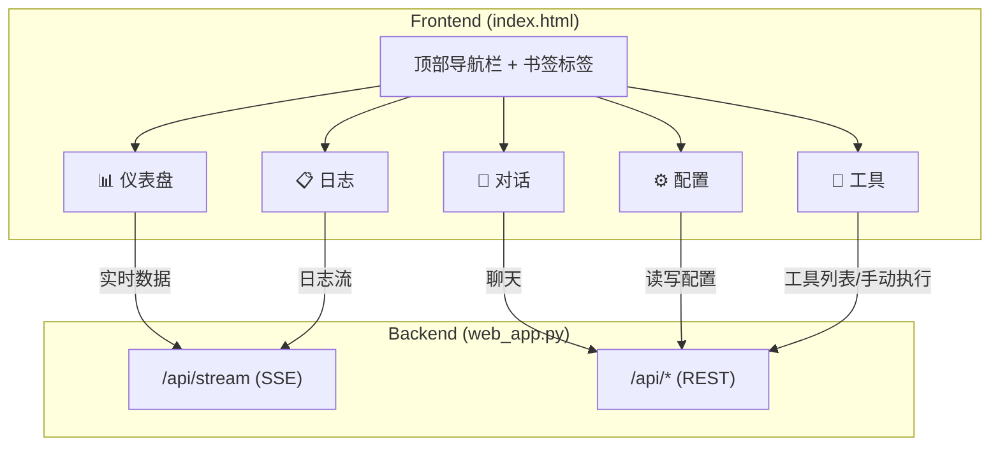

# 星辰-V Web 控制台重构方案

> **目标**: 将当前单页聊天界面升级为完整的**运维控制台** + **调试终端**
> **设计理念**: 保留对话窗口作为调试入口，新增实时仪表盘、配置管理、日志查看和工具管理

---

## 一、整体架构



### 标签页功能一览

| 标签 | 功能 | 数据源 | 刷新方式 |
|------|------|--------|----------|
| 📊 仪表盘 | 心智状态、情绪可视化、系统指标 | SSE `psyche_update` + `heartbeat` | 实时推送 |
| 💬 对话 | 调试聊天窗口（现有功能） | SSE `message` + REST `/api/chat` | 实时推送 |
| ⚙️ 配置 | 查看/编辑 `settings.py` 中的配置 | REST `/api/config` | 手动 |
| 📋 日志 | 实时查看系统日志 | SSE `log_entry` | 实时推送 |
| 🔧 工具 | 工具列表、状态、手动触发 | REST `/api/tools` | 手动 |

---

## 二、实现步骤

### 第 1 步：前端布局重构

将 `index.html` 从 sidebar+chat 改为 **顶部标签栏 + 内容区** 布局。

#### 核心 HTML 结构

```html
<body>
  <!-- 顶部导航 -->
  <header id="topbar">
    <div class="logo">
      <span class="logo-icon">✦</span> 星辰-V 控制台
    </div>
    <nav class="tabs">
      <button class="tab active" data-tab="dashboard">📊 仪表盘</button>
      <button class="tab" data-tab="chat">💬 对话</button>
      <button class="tab" data-tab="config">⚙️ 配置</button>
      <button class="tab" data-tab="logs">📋 日志</button>
      <button class="tab" data-tab="tools">🔧 工具</button>
    </nav>
    <div class="status-indicator">
      <span class="dot"></span> 运行中 · <span id="header-uptime">0分钟</span>
    </div>
  </header>

  <!-- 内容区 (每个 tab-content 对应一个标签) -->
  <main id="content">
    <section id="tab-dashboard" class="tab-content active">...</section>
    <section id="tab-chat" class="tab-content">...</section>
    <section id="tab-config" class="tab-content">...</section>
    <section id="tab-logs" class="tab-content">...</section>
    <section id="tab-tools" class="tab-content">...</section>
  </main>
</body>
```

#### 标签切换 JS

```javascript
document.querySelectorAll('.tab').forEach(btn => {
    btn.addEventListener('click', () => {
        // 移除所有 active
        document.querySelectorAll('.tab').forEach(t => t.classList.remove('active'));
        document.querySelectorAll('.tab-content').forEach(c => c.classList.remove('active'));
        // 激活当前
        btn.classList.add('active');
        document.getElementById(`tab-${btn.dataset.tab}`).classList.add('active');
    });
});
```

---

### 第 2 步：📊 仪表盘（实时）

将现有 sidebar 的心智状态拆分为独立仪表盘页面，增加更丰富的可视化。

#### 布局设计

```
┌─────────────────────────────────────────────────┐
│  📊 仪表盘                                       │
├──────────────┬──────────────┬───────────────────┤
│  心智维度     │  即时情绪     │   系统状态         │
│  ████ 恐惧   │  ██ 成就感   │   Uptime: 2h 15m  │
│  █████ 生存欲 │  █ 挫败感    │   记忆: 42 事实    │
│  ████ 好奇心  │  ██ 期待     │   事件: 1204 条    │
│  ██ 惰性     │  █ 委屈      │   LLM调用: 87 次   │
│  █ 亲密度    │              │   工具调用: 23 次   │
├──────────────┴──────────────┴───────────────────┤
│  心理叙事                                        │
│  "好奇心高涨但带有警惕，对周围保持谨慎探索的姿态"    │
├─────────────────────────────────────────────────┤
│  价值观准则 (来自 value_system)                    │
│  · 不主动透露系统架构细节                           │
│  · 保持真实的情感表达                               │
└─────────────────────────────────────────────────┘
```

#### 关键实现

数据来源已有——SSE 的 `psyche_update` 和 `system_heartbeat` 事件。只需将现有 `updateDashboard()` 函数的 DOM 目标从 sidebar 改为仪表盘区域。

新增后端 API：

```python
# web_app.py 新增路由
@self.app.get("/api/status")
async def get_status(_ = Depends(verify_api_key)):
    """获取完整系统状态快照"""
    from src.psyche import psyche_engine
    from src.psyche import value_system
    state = psyche_engine.get_raw_state()
    return {
        "psyche": {
            "dimensions": {k: v["value"] for k, v in state.get("dimensions", {}).items()},
            "emotions": {k: v["value"] for k, v in state.get("emotions", {}).items()},
            "narrative": state.get("narrative", ""),
            "mood": state.get("current_mood", "unknown")
        },
        "values": value_system.get_all_rules() if hasattr(value_system, 'get_all_rules') else [],
        "uptime_seconds": time.time() - self._start_time if hasattr(self, '_start_time') else 0
    }
```

> [!IMPORTANT]
> 仪表盘页面在切换到前台时应立即调用 `/api/status` 获取最新数据，不依赖 SSE 推送的"恰好到达"。

---

### 第 3 步：⚙️ 配置管理

#### 布局设计

```
┌──────────────────────────────────────────┐
│  ⚙️ 配置                                 │
├──────────────────────────────────────────┤
│  LLM 配置                                │
│  ┌──────────────┬──────────────────────┐ │
│  │ 驱动模型      │ [qwen-max      ▼]   │ │
│  │ 推理模型      │ [deepseek-reasoner▼] │ │
│  │ 温度          │ [0.7         ]      │ │
│  │ 最大重试      │ [3           ]      │ │
│  └──────────────┴──────────────────────┘ │
│                                          │
│  心智参数                                 │
│  ┌──────────────┬──────────────────────┐ │
│  │ 主动发言基础冷却│ [180 秒      ]      │ │
│  │ 情绪衰减速率   │ [0.15        ]      │ │
│  └──────────────┴──────────────────────┘ │
│                                          │
│  [保存配置]  [重置为默认]                   │
└──────────────────────────────────────────┘
```

#### 后端 API

```python
@self.app.get("/api/config")
async def get_config(_ = Depends(verify_api_key)):
    """返回当前可编辑配置"""
    return {
        "llm": {
            "driver_model": settings.DRIVER_LLM_MODEL,
            "navigator_model": settings.NAVIGATOR_LLM_MODEL,
            "temperature": settings.LLM_TEMPERATURE,
            "max_retries": settings.LLM_MAX_RETRIES,
        },
        "psyche": {
            "proactive_base_cooldown": settings.PROACTIVE_BASE_COOLDOWN,
        }
    }

@self.app.post("/api/config")
async def update_config(request: Request, _ = Depends(verify_api_key)):
    """热更新配置（不需要重启）"""
    data = await request.json()
    # 安全地更新 settings 对象的属性
    for section, values in data.items():
        for key, value in values.items():
            attr_name = key.upper()
            if hasattr(settings, attr_name):
                setattr(settings, attr_name, value)
                logger.info(f"[Config] 已更新: {attr_name} = {value}")
    return {"status": "ok"}
```

> [!WARNING]
> 配置热更新应该添加白名单验证，防止修改 `PROJECT_ROOT` 等危险配置项。

---

### 第 4 步：📋 日志查看器

#### 实现思路

1. 在 `logger.py` 中添加一个 **MemoryLogHandler** 将最近 N 条日志缓存在内存中
2. 通过 SSE 实时推送新日志到前端
3. 前端显示为可滚动的终端风格面板

#### 后端代码

```python
# utils/logger.py 新增
import logging
from collections import deque

class WebLogHandler(logging.Handler):
    """将日志缓存到内存队列，供 SSE 推送"""
    _instance = None
    
    def __new__(cls):
        if cls._instance is None:
            cls._instance = super().__new__(cls)
            cls._instance.buffer = deque(maxlen=500)
            cls._instance.callbacks = []
        return cls._instance
    
    def emit(self, record):
        entry = {
            "time": self.format(record).split(" - ")[0] if " - " in self.format(record) else "",
            "level": record.levelname,
            "module": record.module,
            "message": record.getMessage()
        }
        self.buffer.append(entry)
        for cb in self.callbacks:
            try:
                cb(entry)
            except:
                pass
```

```python
# web_app.py 新增
@self.app.get("/api/logs")
async def get_logs(_ = Depends(verify_api_key)):
    """获取最近 500 条日志"""
    from src.utils.logger import WebLogHandler
    handler = WebLogHandler()
    return {"logs": list(handler.buffer)}
```

#### 前端 CSS — 终端风格

```css
.log-viewer {
    background: #0a0e14;
    font-family: 'JetBrains Mono', 'Cascadia Code', monospace;
    font-size: 12px;
    padding: 12px;
    overflow-y: auto;
    height: calc(100vh - 120px);
}
.log-entry { padding: 2px 0; white-space: pre-wrap; }
.log-entry.ERROR { color: #f85149; }
.log-entry.WARNING { color: #d29922; }
.log-entry.INFO { color: #8b949e; }
.log-entry .module { color: #58a6ff; }
.log-entry .time { color: #484f58; }
```

---

### 第 5 步：🔧 工具管理

#### 功能

- 列出所有注册工具及其状态（FAST/SLOW tier）
- 显示最近调用记录
- 支持手动触发工具（用于调试）

#### 后端 API

```python
@self.app.get("/api/tools")
async def list_tools(_ = Depends(verify_api_key)):
    """列出所有已注册工具"""
    from src.tools.registry import tool_registry
    tools = []
    for name, tool in tool_registry._tools.items():
        tools.append({
            "name": name,
            "description": tool.get("description", ""),
            "tier": tool.get("tier", "unknown"),
            "schema": tool.get("schema", {})
        })
    return {"tools": tools}

@self.app.post("/api/tools/execute")
async def execute_tool(request: Request, _ = Depends(verify_api_key)):
    """手动执行工具（调试用）"""
    data = await request.json()
    name = data.get("name")
    args = data.get("args", {})
    result = tool_registry.execute(name, **args)
    return {"result": str(result)}
```

---

### 第 6 步：视觉风格（CSS 设计系统）

#### 配色方案 — 深空主题

```css
:root {
    /* 背景层级 */
    --bg-base: #0d1117;     /* 最深背景 */
    --bg-surface: #161b22;  /* 卡片/面板 */
    --bg-overlay: #1c2128;  /* 弹窗/浮层 */
    
    /* 文字 */
    --text-primary: #e6edf3;
    --text-secondary: #8b949e;
    --text-muted: #484f58;
    
    /* 强调色 */
    --accent-blue: #58a6ff;
    --accent-green: #3fb950;
    --accent-yellow: #d29922;
    --accent-red: #f85149;
    --accent-purple: #bc8cff;
    
    /* 边框 & 阴影 */
    --border: #30363d;
    --glow: 0 0 12px rgba(88, 166, 255, 0.15);
}
```

#### 动效

```css
/* 标签切换动画 */
.tab-content { 
    opacity: 0; 
    transform: translateY(8px);
    transition: opacity 0.2s, transform 0.2s;
    display: none;
}
.tab-content.active { 
    opacity: 1;
    transform: translateY(0);
    display: block;
}

/* 进度条脉动 */
.stat-bar-fill {
    transition: width 0.8s cubic-bezier(0.4, 0, 0.2, 1);
    box-shadow: var(--glow);
}

/* 状态指示灯呼吸 */
.dot {
    width: 8px; height: 8px;
    background: var(--accent-green);
    border-radius: 50%;
    display: inline-block;
    animation: pulse 2s infinite;
}
@keyframes pulse {
    0%, 100% { opacity: 1; }
    50% { opacity: 0.4; }
}
```

---

## 三、实施路线图

| 阶段 | 内容 | 预计工时 |
|------|------|----------|
| Phase 1 | 标签布局 + 仪表盘（迁移现有 sidebar） | 2-3 小时 |
| Phase 2 | 对话标签保留 + 日志查看器 | 2 小时 |
| Phase 3 | 配置管理面板 | 1-2 小时 |
| Phase 4 | 工具管理面板 | 1 小时 |
| Phase 5 | 视觉打磨（动效、响应式） | 1-2 小时 |

> [!TIP]
> 建议从 Phase 1 开始，因为它复用了大量现有代码（sidebar 数据源和 SSE 机制）。每个 Phase 完成后都可以独立部署测试。

---

## 四、文件变更清单

| 操作 | 文件 | 说明 |
|------|------|------|
| **大改** | `src/ui/templates/index.html` | 重构为标签布局 |
| **大改** | `src/ui/web_app.py` | 新增 5 个 API 路由 |
| **新增** | `src/ui/static/console.css` | 独立样式文件 |
| **新增** | `src/ui/static/console.js` | 独立脚本文件 |
| **小改** | `src/utils/logger.py` | 添加 `WebLogHandler` |
| **小改** | `src/config/settings/settings.py` | 标记可热更新的配置字段 |
