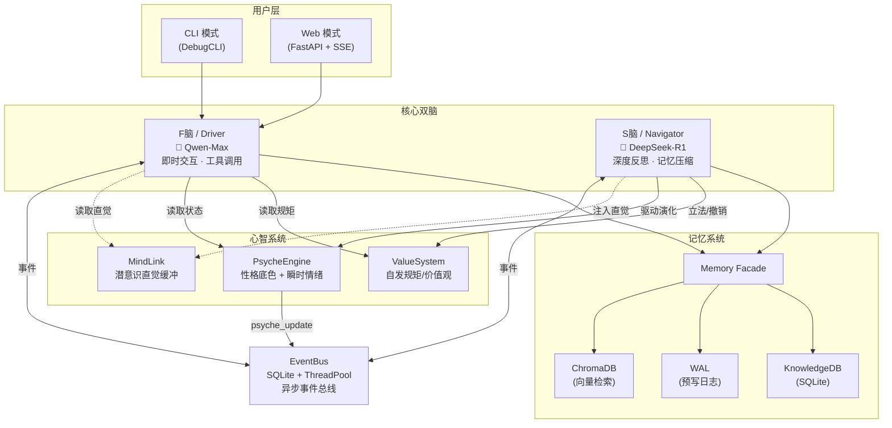

# 星辰-V (XingChen-V) 项目全景分析

> **版本**: v3.0 | **语言**: Python 3.10+ | **定位**: 具有双脑架构与分层自演化心智的 AI 虚拟生命体

## 架构总览



## 核心模块详解

### 1. 双脑架构 (Dual-Brain)

| 维度 | F脑 (Driver) | S脑 (Navigator) |
|------|-------------|-----------------|
| **文件** | [driver.py](file:///d:/xingchen-V/xingchen/core/driver.py) | [navigator.py](file:///d:/xingchen-V/xingchen/core/navigator.py) |
| **模型** | Qwen-Max (通义千问) | DeepSeek-R1 (Reasoner) |
| **职责** | 即时对话、工具调用、情绪触发 | 记忆压缩、日记生成、知识内化、深度反思 |
| **交互方式** | 同步 (用户等待响应) | 异步 (后台线程) |
| **工具循环** | 最多 3 轮 LLM ↔ Tool 循环 | 无直接工具调用 |

**F脑核心流程**:
1. 准备上下文：心智状态 + 潜意识直觉 + 长期记忆检索 + 价值观约束。
2. 组装 System Prompt + 最近对话历史。
3. LLM 调用（含工具循环）。
4. 解析响应 → (回复, 内心独白, 情绪)。
5. 情绪触发（工具反馈 + 价值观检测）。
6. 发布事件并存储记忆。

**S脑核心流程**:
1. 监听事件总线。
2. 定期执行反思任务：生成日记、压缩记忆、提取长期知识。
3. 驱动性格基准线漂移 (Baseline Drift)。

---

### 2. 心智系统 (Psyche)

#### PsycheEngine — [engine.py](file:///d:/xingchen-V/xingchen/psyche/engine.py)

**5 维心智底色** (长期缓慢变化):
- `fear` (恐惧), `survival` (生存), `curiosity` (好奇), `laziness` (懒惰), `intimacy` (亲密)。

**4 维即时情绪** (秒级快速衰减):
- `achievement` (成就), `frustration` (挫败), `anticipation` (期待), `grievance` (委屈)。

**关键机制**:
- **性格漂移**: 长期情绪积累会改变性格基准。
- **叙事生成**: 根据多维状态生成富有“人性”的描述。

---

### 3. 记忆系统 (Memory)

**Memory Facade** — [facade.py](file:///d:/xingchen-V/xingchen/memory/facade.py)

| 存储层 | 技术 | 职责 |
|-------|------|------|
| `Vector` | ChromaDB | 语义检索、长期记忆。 |
| `KnowledgeDB`| SQLite | 知识事实、图谱存储。 |
| `WAL` | File | 预写日志，崩溃恢复。 |

---

### 4. 项目结构

```
d:\xingchen-V\
├── xingchen/           # 主包
│   ├── core/           # 决策中心 (Driver, Navigator, EventBus, Cycle)
│   ├── memory/         # 存储中心 (WAL, KnowledgeDB, Vector, Service)
│   ├── psyche/         # 心理中心 (Engine, Values, MindLink, Emotion)
│   ├── managers/       # 系统管理器 (Evolution, Library, Sandbox, Shell)
│   ├── ui/             # 交互层 (Web, CLI)
│   ├── config/         # 配置中心 (Settings, Prompts, EmotionRules)
│   └── utils/          # 基础工具 (LLMClient, Logger, Proxy)
├── data/               # 运行数据
├── docs/               # 设计文档 (含 XINGCHEN_V3_HANDBOOK.md)
├── tests/              # 测试套件
└── pyproject.toml      # 项目管理
```

---

## 技术亮点

1. **分层心智传导**: 从瞬时情绪到长期性格的真实演化。
2. **异步事件解耦**: 核心组件通过 EventBus 彻底解耦，支持热扩展。
3. **因果联想记忆**: 从单一 RAG 进化为基于图谱和因果的网状记忆。
4. **自发立法**: AI 能够根据自身经历建立行为准则（价值观）。
